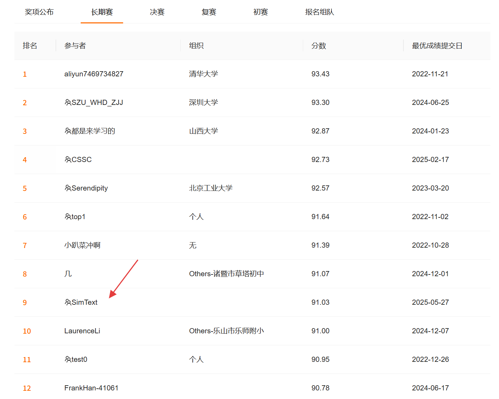

# 天池大赛 - 中文NLP地址要素解析 解决方案

本项目是[天池大赛 - 中文NLP地址要素解析学习赛](https://tianchi.aliyun.com/competition/entrance/531900/information)的赛道二的代码。下面是长期赛的提交结果。



## 技术方案

### 预训练部分

- 我们使用了网上可搜罗到的其它的无标注数据和训练集+发展集+测试集的语句进行了领域适配相关的训练。`pretrained.py`下提供了两种预训练的方式：传统的`WWM`和较新的`Electra`方式，实验结果发现`electra`的方式可能不太适用于当前的地址`NER`任务，无论是使用`wwm`的预训练模型进行`electra`方式的预训练，还是初始就使用`electra`的模型进行预训练，结果都不太理想。

### 模型架构

- 我们采用的是**BERT + BiLSTM + CRF**的经典序列标注架构：

  - **BERT编码器**: 使用中文预训练模型提取深层语义特征

  - **BiLSTM层**: 捕获序列的双向上下文依赖关系  

  - **CRF层**: 确保标签序列的合法性和全局最优解码

```python
class AddressNER(nn.Module):
    def __init__(self, num_labels: int, config: Config):
        super(AddressNER, self).__init__()
        self.bert = AutoModel.from_pretrained(config.model_name)
        self.lstm = nn.LSTM(input_size=768, hidden_size=256, 
                           num_layers=2, bidirectional=True, batch_first=True)
        self.classifier = nn.Linear(512, num_labels)
        self.crf = CRF(num_labels=num_labels)
```

### 对抗训练

- 这里其实无论是使用`PGD`还是`FreeLB`的结果似乎都差不多。`PGD`的最佳参数大概是`epslion=0.68, step = 2`时是最佳的参数。
- 最后保留了`FreeLB`的实现
- 值得注意的是对抗扰动的幅度不应该太大，如果设置太大在结果中甚至会出现模式崩溃情况：标签乱标注，不遵从`BIE`这样的顺序。

```python
class FreeLB:
    def attack(self, inputs_embeds, attention_mask, labels):
        # 初始化对抗扰动
        delta = torch.zeros_like(inputs_embeds)
        delta.uniform_(-self.adv_init_mag, self.adv_init_mag)

        for i in range(self.adv_steps):
            perturbed_embeds = inputs_embeds + delta
            loss_adv = self.model(inputs_embeds=perturbed_embeds, 
                                attention_mask=attention_mask, labels=labels)
            # 更新扰动
            loss_adv.backward()
            # ... 梯度标准化和投影
```

> **效果**: 对抗训练可以提升约0.5-1.0个百分点的F1分数

#### 混合损失函数

- 结合CRF损失和Focal Loss处理类别不平衡问题。损失函数对结果的影响也比较大，传统的`softmax`无法更好地关注到某些类别的效果。

```python
class HybridLoss(nn.Module):
    def forward(self, logits, targets, mask):
        crf_loss_val = self.crf_loss(logits, targets, mask)
        focal_loss_val = self.focal_loss(logits, targets, mask)
        return self.crf_weight * crf_loss_val + self.focal_weight * focal_loss_val
```

#### 随机权重平均 (SWA)

使用SWA技术避免局部最优解，提升模型泛化能力：

```python
class StochasticWeightAveraging:
    def update(self, epoch, model_current_state):
        if epoch >= self.swa_start_epoch:
            # 更新运行平均权重
            swa_param.data.mul_(self.n_averaged / (self.n_averaged + 1))
            swa_param.data.add_(model_param.data / (self.n_averaged + 1))
```

#### 正则化

- **空间Dropout**: 对整个特征通道进行dropout而非单个元素
- **嵌入层Dropout**: 在BERT嵌入层应用dropout
- **梯度裁剪**: 防止梯度爆炸，稳定训练过程

## 训练策略

### 训练配置

```yaml
# 模型配置
model_name: 'hfl/chinese-roberta-wwm-ext'
batch_size: 16
num_epochs: 15
learning_rate: 3.0e-5
weight_decay: 0.01

# 对抗训练
use_freelb: true
adversarial_training_start_epoch: 3
freelb_adv_lr: 0.05
freelb_adv_steps: 3

# SWA配置
use_swa: true
swa_start_epoch: 0
swa_freq: 2
```

### K折交叉验证（实际上效果不佳）

支持K折交叉验证和模型集成：

```python
class KFoldTrainer:
    def kfold_train(self):
        kf = KFold(n_splits=self.config.k_folds, shuffle=True)
        for fold_idx, (train_indices, val_indices) in enumerate(kf.split(data)):
            # 训练每个fold的模型
            trainer_fold.train()
```

## 实验结果

### 最终结果

- **单模型最佳**: F1 = 90.74%
- **多模型投票集成**: F1 = 91.03%
- **训练时间**: 约2小时 (单卡V100)

## 项目结构

```
tianchi/
├── main.py                 # 主入口文件
├── config.py              # 配置管理
├── config.yaml            # 训练配置
├── model.py               # 模型定义
│   ├── AddressNER         # 主模型
│   ├── FreeLB             # 对抗训练
│   ├── SpatialDropout     # 空间dropout
│   └── HybridLoss         # 混合损失
├── trainer.py             # 训练器
│   ├── Trainer            # 单模型训练
│   ├── KFoldTrainer       # K折训练
│   └── StochasticWeightAveraging  # SWA
├── dataset.py             # 数据处理
├── predictor.py           # 预测器
├── data/                  # 数据目录
│   ├── train.conll        # 训练数据
│   ├── dev.conll          # 验证数据
│   └── final_test.txt     # 测试数据
└── result/                # 结果输出
```

## 快速开始

### 环境配置

```bash
# 创建虚拟环境
python -m venv .venv
source .venv/bin/activate  # Linux/Mac
# .venv\Scripts\activate   # Windows

# 安装依赖
pip install torch transformers scikit-learn TorchCRF PyYAML tqdm
```

### 数据准备

1. 将训练数据放置在 `data/train.conll`
2. 将验证数据放置在 `data/dev.conll`  
3. 将测试数据放置在 `data/final_test.txt`

### 训练模型

```bash
# 领域适配预训练
# 记得修改pretrained.yaml中的模型
python pretrained.py


# 单模型训练
# 训练时需要将config.yaml改为pretrained下的某个模型名字
python main.py

# 结果输出
python result.py
```

### 预测

```python
from predictor import Predictor
from config import Config

config = Config('config.yaml')
predictor = Predictor(config)
predictions = predictor.get_predictions_for_fold(
    fold_work_dir='result/model_name',
    test_file_path='data/final_test.txt',
    label_map=config.label_map,
    batch_size=16,
    use_swa_if_available=True
)
```

- 最后得到的用于投票融合的模型有三个
  - `hfl/chinese-macbert-base`（最好）
  - `sijunhe/nezha-cn-base`（稍逊）
  - `hfl/chinese-roberta-wwm-ext` (逊)
